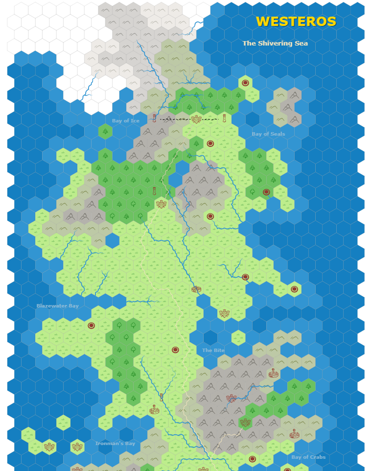
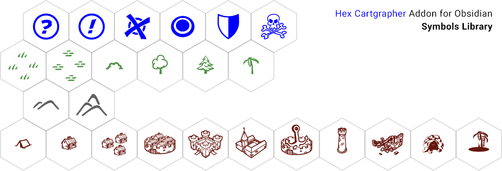
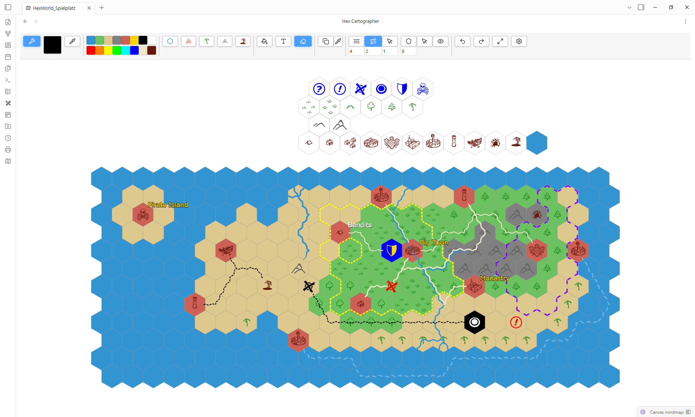
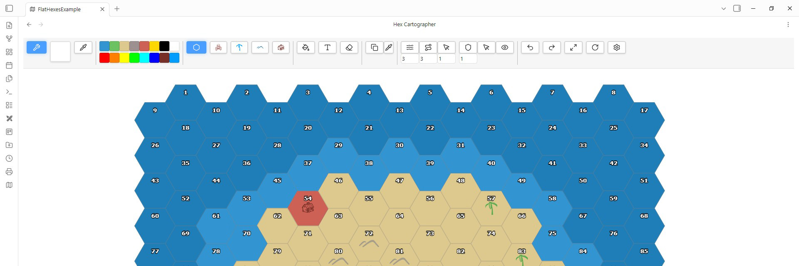
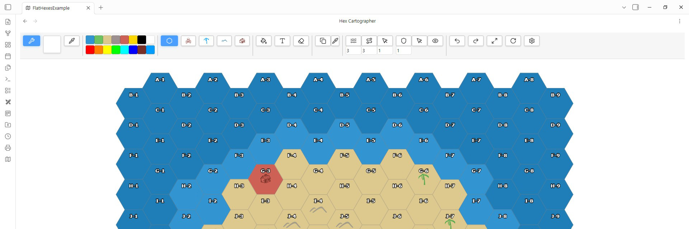
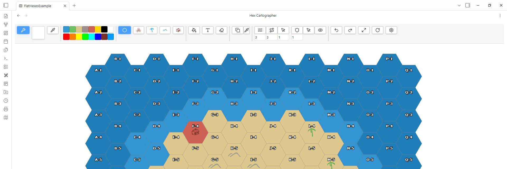

# Hex Cartographer

**Bring Your Fantasy Worlds to Life**

Hex Cartographer is a visual hex map editor for [Obsidian](https://obsidian.md). Create detailed fantasy world maps with colored hex tiles, hand-crafted SVG symbols, rivers, roads, borders, and text annotations — all stored as plain text in your vault.

Your finished maps can be printed or exported as high-resolution PNG/JPEG images — perfect for RPG game masters, fantasy authors, and worldbuilders.

## Example Map

## Symbols Library

## Editor

### Flexible Coordinate System

## Features

#### Hex Grid Editor
- Infinite scrollable hex grid canvas
- Paint hexes with custom colors and palettes
- Color eyedropper to pick colors from the map
- Fill tool for quick area painting
- Pattern stamp tool to apply repeating tile layouts
- Change map orientation to get flat top hexagons instead of pointy top
- Flexible coordinate system with multiple modes

#### Symbols & Terrain
- 25+ hand-crafted SVG symbols across 4 groups: Extras, Vegetation, Mountains, Buildings
- Symbols inherit the active master color for full flexibility
- Right-click to switch between symbol variants

#### Rivers, Roads & Borders
- Draw rivers and roads by placing waypoints
- Adjustable line width and dash patterns
- Rivers taper naturally at dead ends
- Draw border regions with customizable styles
- Toggle border visibility on/off

#### Text Annotations
- Place text labels anywhere on the map
- Customize font size, color, bold, and italic
- Link text to other notes in your Obsidian vault

#### Export & Print
- Export maps as high-resolution PNG or JPEG
- Optionally crop bitmaps to map borders
- Print directly from the three-dot menu
- On mobile, exports are saved next to the map file

#### Full Mobile Support
- Touch-optimized: tap to place, swipe to draw
- Two-finger pinch to zoom, two-finger drag to pan
- Long-press on tool buttons for variant selection

## Installation

1. Open Obsidian Settings
2. Go to **Community Plugins** and disable **Restricted Mode**
3. Click **Browse** and search for **Hex Cartographer**
4. Click **Install**, then **Enable**

#### Manual Installation
1. Download `main.js`, `styles.css`, and `manifest.json` from the [latest release](https://github.com/Taroslord/Hex-Cartographer/releases)
2. Create a folder `hex-cartographer` in your vault's `.obsidian/plugins/` directory
3. Place the downloaded files inside
4. Restart Obsidian and enable the plugin

## Getting Started

1. Right-click a folder in the file explorer and select **Create new Hex Cartographer Map**
2. Toggle **Edit Mode** to start drawing
3. Select a color from the palette and click hexes to paint terrain
4. Switch tool groups in the toolbar to place symbols, draw paths, or add text
5. Use **Ctrl+Z** / **Ctrl+Y** to undo and redo

## Controls

| Action | Desktop | Mobile |
|--------|---------|--------|
| Paint / Place | Left-click | Tap |
| Erase | Right-click (hold + drag for multiple) | Eraser Icon |
| Erase all | Double right-click | Eraser Icon, then double tap|
| Zoom | Mouse wheel | Two-finger pinch |
| Pan | Middle mouse / Shift+Drag | Two-finger drag |
| Symbol variant | Right-click tool button | Long-press tool button |
| Palette color | Right-click palette slot | Long-press palette slot |
| Undo | Ctrl+Z | Undo Icon |
| Redo | Ctrl+Y | Redo Icon |

## Languages

**Hex Cartographer supports 11 languages**. The language is automatically detected from your Obsidian settings.

German, English, Chinese, Russian, Japanese, French, Portuguese, Korean, Spanish, Polish, Italian

## License

This plugin is licensed under the [GNU General Public License v3.0](LICENSE).

---

